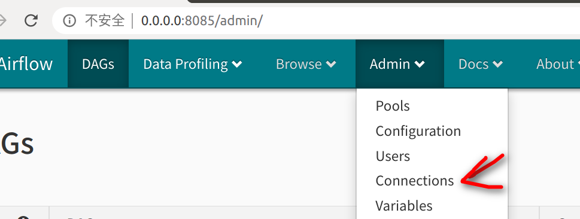

# Data Lake for Citi Bike Trip
### Data Engineering Capstone Project

#### Project Summary
IN 2020 the **covid-19** shocked the world, lives and works of  millions of people around the world had been affacted. But how serious is the shock?  This project choooses `Citi Bike Trip`  which is mainly conducted in NYC to do an simple access. To achieve that target, the projecct builds a Spark Data Lake from several data sources which are `trip history`, `station`, `covid case` and `hourly weather`. The data lake is modeled in a star-schema model which is helpful to answer the questions like "Before or  after the **covid-19** where do Citi Bikers ride? When do they ride? How far do they go? Which stations are most popular?"

The project follows the follow steps:
* Step 1: Scope the Project and Gather Data
* Step 2: Explore and Assess the Data
* Step 3: Define the Data Model
* Step 4: Data dictionary
* Step 5: How to run
* Step 6: Special Scenarios

### Step 1: Scope the Project and Gather Data

#### Scope 
To analyze the bike trip history data,the project aims to build an data pipeline which has the ability to handle massive and periodical data ELT. The data pipleline is designed to a star schemas which is easy to understand. And the pipeline runs on Cloud to provide highly availability.

#### Data Modeling tools
- Fetch the dataset:The project fetches data with  `Requests`
- Save the dataset: Firstly the project gets data on local. After unzipped or transformed the clean data to `Amazon S3`.
- Compute the ELT. The project runs cloudly in AWS products like `Amazon  EMR` and `Apache Spark` which are easy to increase the  computing power.
- Run an Pipline .The project runs the ELT periodically with the power of `Apache Airflow`. 


#### Describe and Gather Data 

Citi Bike Trip Histories
- This data (source https://www.citibikenyc.com/system-data) has been processed to remove trips that are taken by staff as they service and inspect the system, trips that are taken to/from any of our “test” stations (which we were using more in June and July 2013), and any trips that were below 60 seconds in length (potentially false starts or users trying to re-dock a bike to ensure it's secure).
- 1 million+ rows per month
- format:csv
- https://s3.amazonaws.com/tripdata/index.html

Citi Bike Stations
- This data indicates real-time sations of `Citi Bike Trip`.
- format: api
- https://gbfs.citibikenyc.com/gbfs/en/station_information.json

Covid-19 in NYC
- Covid-19 case in NYC daily updated report
- format: csv
- https://github.com/nychealth/coronavirus-data/blob/master/trends/cases-by-day.csv

Weather in NYC
- Hourly weather of NYC
- format: api
- https://api.weather.com/v1/location/KLGA:9:US/observations/historical.json. To get the data, an enrollment to https://weather.com/ is needed. The website will provide a `apiKey`.

### Step 2: Explore and Assess the Data
#### Explore the Data 
The projecct takes some demo dataset and identifies data quality issues, like missing values, duplicate data, etc.
- Citi Bike Trip Histories. `202001-citibike-tripdata.csv.zip` was downloaded, and the dataset has good data quality. Limitations are that some headers of columns has some blank like `birth year`. This was handled in ELT with spark.

- Covid-19 in NYC. The main question is that the report started from `02/29/2020` which is not the start time of project `trip history`. The project provided a complement report which contains zero for all columns. 

- Citi Bike Stations. Data quality is good as an api.

- Weather in NYC. Data quality is good as an api.


#### Cleaning Steps
- Covid-19 in NYC. The header is upper and transformes into lowercase in spark later.

### Step 3: Define the Data Model
#### 3.1 Conceptual Data Model
This project models a star schema data model which is easy for data analysis.


#### 3.2 Mapping Out Data Pipelines


This project takes use of `Airflow` to do data pipeline. Because the trip history is published monthly,the pipeline runs monthly too. And the pipeline runs from `01/01/2020` to `12/31/2020` monthly.The main pipeline can be divided into these steps:
- 1. Download data from S3 and API and do some transform such as unzipping or complementing data.
- 2. Upload data and scripts to S3 inputs.
- 3. Start Amazon EMR.
- 4. Build Spark Data Lake in EMR. (EMR runs `spark_elt_emr.py`)
- 5. Do data quality checks and save ouputs in EMR. (EMR runs `spark_check_emr.py`)
- 6. clean input for the next run.

### Step 4 Data dictionary 
**bikeshare_fact_table**

|field|type|value|
|:-----|----|:-----|
|id   |string|the id of table    |
|start_time| datetime|time the ride trip starts|
|duration| int|time the rider spent on the trip    |
|year| int|year of the trip    |
|month| int|month of the trip    |
|start_station_id| int|the station which the trip starts    |
|end_station_id| int|the station which the trip ends    |
|bike_id| int|the bike the rider rided    |
|user_agg_id| string|user values combined with birth of year and  gender   |
|covid_id| date|the date of covid cases in NYC    |
|weather_id| datetime| hourly weather of start_time   |

**dim_station**


|field|type|value|
|:-----|----|:-----|
| station_id | int | station_id  |
| external_id | string|station_id in form of encrypted way   |
| name | string| the name of stations  |
| short_name | float| short_name of the stations in float number   |
| region_id | int|  region_id |
| legacy_id | int| legacy_id  |
| station_type | string| the type of stations  |
| latitude | float| latitude of the staion  |
| longtitude | float| longtitude of the staion   |
| capacity | int| the bike capacity of stations  |
| has_kiosk | bool| whether the station has  kiosk |
| electric_bike_surcharge_waiver | bool| whether the station has  electric bike surcharge waiver |
| eightd_has_key_dispenser | bool|  whether the station has  key dispenser|
| rental_methods | list| rental methods  the station support |

**dim_time_table**

|field|type|value|
|:-----|----|:-----|
|start_time |datetime|time the ride trip starts   |
|minute |int| minute of start_time  |
|hour |int| hour of start_time  |
|day| int| day of start_time  |
|week| int| week of start_time  |
|month |int| month of start_time   |
|year |int| year of start_time   |
|weekday |int| weekday of start_time   |


**dim_user_agg_table**


|field|type|value|
|:-----|----|:-----|
|user_agg_id |string| user_agg_id  |
|usertype |string| Customer = 24-hour pass or 3-day pass user; Subscriber = Annual Member|
|gender |int| Zero=unknown; 1=male; 2=female  |
|birth_year |int|Year of Birth   |
    
**dim_bike_table**


|field|type|value|
|:-----|----|:-----|
|bike_id|int|Bike ID   |

**dim_covid_table**


|field|type|value|
|:-----|----|:-----|
|covid_id |date  | the date covid cases reported   |
|bx_case_count |int| The Bronx of NYC case count  |
|bx_probable_case_count |int|  The Bronx of NYC probable case count  |
|bk_case_count |int| Brooklyn of NYC probable case count |
|bk_probable_case_count |int| Brooklyn of NYC probable case count  |
|mn_case_count |int| Manhattan of NYC  case count  |
|mn_probable_case_count |int| Manhattan of NYC probable case count  |
|qn_case_count |int| Queens of NYC  case count |
|qn_probable_case_count |int|Queens of NYC probable case count |
|si_case_count |int|Staten Island of NYC  case count    |
|si_probable_case_count |int|   Staten Island of NYC probable case count  |
|incomplete |int|  case count has not be put in the five districts above of NYC,mainly zero  |

**dim_weather_table**


|field|type|value|
|:-----|----|:-----|
|weather_id |datetime | hourly datetime  |
|temperature |int| the  temperature of NYC  |
|dew_point |int|  dew point temperature |
|humidity |int| humidity,percent  |
|wind |string| wind direction  |
|wind_speed |int|  wind speed, mph |
|wind_gust |int|  wind gust, mph |
|pressure |float| weather pressure  |
|precip |float| precipitation    |
|condition |string| weather condition like 'Cloudy','Windy'   |

### Step 5: How to run
#### Project structure

```
dags
├── udac_capstone_emr.py                            # The data pipeline dag used in `Airflow`
├── bks_aws.cfg                                     # basic config of the project, need to set [MAIN_PATH] before first run
├── requirements.txt                                # required python package to run the project
├── images                                          # folder to locate images used in README.md
│   ├── citi bike trip star schema.png              # picture of citi bike trip star schema
│   ├── airflow pipline.png                         # picture of airflow pipline
│   └── airflow_connection.png                      # picture of airflow connection
├── script_emr                                      # foler to locate python scripts which would run in `Amazon EMR`
│   ├── spark_elt_emr.py                            # spark elt script for the project
│   └── spark_check_emr.py                          # spark data qulity validation for the project 
├── script_operator                                 # folder to locate self made operator
│   └── operator_data_upload.py                     # operator used to upload data from local to S3
├── script_dags                                     # folder to locate script which referred by `dags` script
│   ├── simple_to_s3.py                             # script to upload file to S3 in a simple way
│   ├── clean_input_s3.py                           # script to do clean in both local and s3 for the next run 
│   └── crawl_to_local.py                           # script to craw different data from several sources.
└── data                                            # folder to locate complementary data
    └── stage_covids_complement.csv                 # csv data to complement unreported zero covid cases.
```

#### usage

##### Get started 

Make sure apache-airflow has installed on the computer.
```
pip install apache-airflow
```
##### config Apache Airflow
- follow the quick start, airflow can run, you can see airflow webui. 
 https://airflow.apache.org/docs/apache-airflow/stable/start/local.html
 
- set up amazon cloud conections at airflow webserver ui,`Admin-Connections`


>
>**config `aws_default`.**
>
> 'Conn Type': choose 'Amazon Web Services'; 
>
>'Login': fill Access key ID of the IAM User; 
>
>'Password': fill Secret key of the IAM User;
>
>'Extra': fill your default aws region like { "region_name": "eu-east-1"}    

>
>**config `emr_default`.**
>
> 'Conn Type': choose 'Elastic MapRedue'; 
>
>'Login': fill Access key ID of the IAM User; 
>
>'Password': fill Secret key of the IAM User;
>
>
##### config script  
- download or clone repository to local, and extract all the files in  the dags folder under `~airflow/dags`


>
>**config `bks_aws.cfg`** 
>
>(important, can not be omitted)
>
>modify the local path and S3 path of `[MAIN_PATH]` to your version.
>

>
> **conifg `udac_capstone_emr.py` and `crawl_to_local.py`**
>
> (if your $AIRFLOW_HOME directory is `~/airflow` by default after you install airflow, this step can be omitted)
>
> open two scripts and find a line like 
>
> ```
> config.read('/home/cheny/airflow/dags/bks_aws.cfg') 
> ```
> 
> replace the absolute path of `bks_aws.cfg` on your computer.
                                                                                                                                                                                                                                                                                                                                                                                
##### run the data pipeline
- when a dag named `udac_capstone_emr` in the airflow ui, turn the toggle on and the data pipeline should start to work.


###  Step 6: Special Scenarios
####  If the data was increased by 100x.
- The bottleneck of the data pipeline would be to download from S3, unzip, gzip and  upload to S3. This process can be done directly using Amazon EMR in python when in need. The computing capability in EMR Spark can be extended by adding more EC2. 

#### If the pipelines were run on a daily basis by 7am.
- The pipeline can be scheduled daily in Airflow.

#### If the database needed to be accessed by 100+ people.
- After confirming the needed queries, we can transfer the output data from S3 to Cassandra which has high availability.


